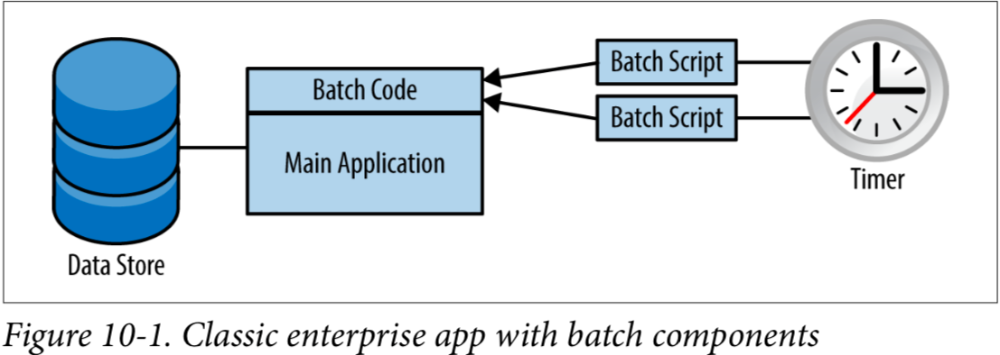
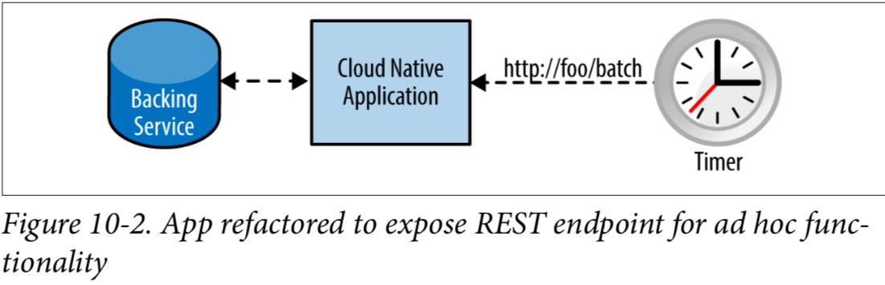

# 
CHAPTER 10

### Administrative Processes

第十二个也是最后一个原始的因素说的是“将管理/管理任务作为一次性进程运行”。我觉得这个因素可能会产生误导。管理进程的概念本身并没有什么错，但是依然有很多你不应该使用它们的原因

原始的12要素关于这一点的问题在于，它固执的认为管理进程应该用解释型语言例如Ruby或者交互型编程方式例如shell来编写。管理进程是一种作者希望用户去使用的功能

我认为，在某些情况下，使用管理进程实际上是一个坏主意，你应该始终扪心自问，管理进程究竟是不是你想要的，又或者是否存在更合适你的设计或者架构。可能应该重构为其他内容的管理进程示例包括：

* 数据迁移
* 交互式控制台
* 运行定时脚本，比如一个凌晨的批量任务
* 运行一次性的自定义的程序

首先，让我们看看计时器的问题（通常由Autosys或Cron等应用程序管理）

一种想法可能是将计时器内部化，让应用程序每n小时唤醒一次以执行其批处理操作。从表面上看，这看起来是一个很好的解决方案，但是当有20个应用程序实例在一个可用性区域中运行，而另外15个实例在另一个可用性区域中运行时，会发生什么情况呢？如果它们都在计时器上执行相同的批处理操作，基本上就是在引发混乱，而损坏或重复的数据将只是这种模式产生的众多麻烦之一

又或者用交互式shell促发来解决（指批量处理的功能以REPL的方式暴露），可是这样也有很多问题，其中最大的一个问题是，即使可以访问该shell，也只能与单个实例的临时内存进行交互。如果应用程序是作为无状态进程正确构建的，那么我认为在进程内部暴露REPL几乎没有任何价值

接下来，让我们看看触发定时或批处理管理进程的机制。这通常发生在一些外部计时器刺激（如cron或Autosys）执行shell脚本时。在云中，您不能指望能够调用这些命令，因此您需要找到其他方法来触发应用程序中的特殊活动

在图10-1中，您可以看到一个应用程序的经典企业体系结构，它有自己的常规职责，并通过执行shell脚本支持批处理或定时操作。这在云中显然行不通

Figure 10-1

有几种解决方案可以解决这个问题，但我发现最吸引人的一种解决方案，特别是在将应用程序的其余部分迁移到云平台上时，就是公开一个RESTful端点，该端点可用于调用特殊功能，如图10-2所示。

另一种可选的方法是从主应用程序中提取与批处理相关的代码，并创建一个单独的微服务，它也采用类似于上图中的体系结构

这仍然允许随意调用定时功能，但它会将此操作的促发转移到应用程序之外。此外，此方法还解决了动态扩容实例上内部计时器最多执行一次的问题。批处理操作由一个应用程序实例处理一次，然后您可以与其他后端服务交互以完成任务。保护批处理端点也应该相当简单，这样就只能由授权人员操作。更有用的是，您的批处理操作现在可以弹性伸缩，并利用所有其他云优势

即使是上面的解决方案，在架构上也存在多种形式，一些形式可以让你无需在程序内部暴露批量处理的功能

如果您仍然觉得需要使用管理进程，那么您应该确保您这样做的方式符合云提供商提供的功能。换句话说，不要使用您最喜欢的编程语言来派生新的进程来运行任务；使用以云原生方式运行的一次性任务的程序。在这种情况下，您可以使用类似Amazon Web Services Lambdas的解决方案，这些功能可以按需调用，并且不需要像前面的microser-vice示例中那样在配置好的服务器中运行

### 项目主页
* [beyond-twelve-factors-app 中文版](../README.md)
