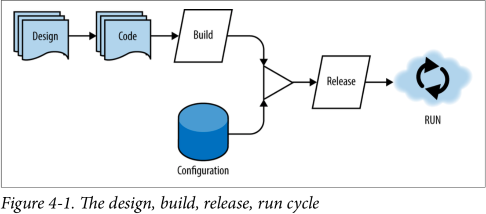

# 
CHAPTER 4

### Design,Build,Release,Run

原始的Factor 5,release,run的意识是严格的区分构建和运行阶段，这是一个非常棒的建议，如果你没有遵守这条规则将会给你带来很多麻烦。除了构建，发版，运行，设计这一步也很重要

在下面的4-1，你能看见一个从设计到运行的流程图，注意这不是一个瀑布流程：从设计到编码再到运行是一个个迭代周期，迭代周期可以跟进时间来自由调配。如果你的团队又一个自动的CI/CD管理线，从设计到在生产环境运行可能只需要几分钟

单个代码仓库通过构建得到一个artifact，这个artifact然后与程序外部的应用配置合并成一个不可变的release。这个不可变的release被分发到云环境和运行起来，本节的要点是强调上面的四个阶段是完全隔离并且独立发生的

#### Design

在瀑布应用的开发过程中，我们在真正开始编码前花费了大量的时间去设计这个应用。这种开发流程已经不适应现代的快速迭代的需求了

并不是说我们不需要去设计，而是说，我们设计一个个能够单独发布的小功能，小的设计是整个迭代周期里面的其中一部分

应用开发者最好理解应用依赖，在设计阶段就去明确哪些依赖是供应商提供，哪些依赖是自己提供。换句话说，开发者在设计阶段决定最终哪些依赖会与开发的应用打包到一起发布

#### Build

构建阶段是将代码仓库的源代码转换成一个带版本的二进制的artifact.在这个阶段，设计阶段声明的依赖会被提取并且捆绑到构建好的artifact（通常简化成“build”）。在java的世界里面，一个build可能是一个WAR或者一个JAR文件，或者是一个ZIP文件，或者是一个可执行的二进制文件

构建通常是由一个持续集成的服务器完成，构建和部署之间通常是一个1:N的关系。单个构建可以被发布或者部署到任意多的环境，并且每一个不可变的构建应该是符合期望的运行。坚持这种不可变的artifact和其他的factor（特别是环境等价），将会给你足够的信心：如果你的程序能在测试环境运行良好，那么也应该能在生产环境运行良好

如果你曾经也遇到了“在我的电脑上运行的好好的”这种问题，那说明你的程序的四个阶段有可能没有被完全分离。强迫你的团队成员使用CI服务器可能前期看会有由点投入，但是一旦坚持下来，你会发现“one build,many deploys” 开始由效果了

一旦您确信自己的代码库可以在任何地方运行，并且不再担心生产版本问题，你将开始看到云原生理念的真正惊人的好处，例如，持续部署和发布可以在需求接收之后的数小时之内发生

#### Release

在云原生的世界里，发布通常是指将你的artifact推送到云环境，构建阶段产生的输出和环境，以及应用配置信息一起组成了另外一个不可变的artifact，一个release

每一个Releases需要又一个唯一的ID来标识，可能是一个时间戳，也可能是一个自增长的数字。由于build和release之间的1:N的关系，所以release不能直接使用build的ID

我们假设你的CI系统以及构建好了你的应用，并且标记为build-1234,CI系统然后释放build的输出到dev，测试和生产环境，每一个release都应该又一个唯一的id，因为这个release不仅仅包含原始的build输出，还包括环境的特定信息

如果发布的程序有问题，如有必要，你可以回滚到上一个release，这就是其中一个很重要的原因：为什么release是不可变，并且唯一标识的

#### Run

运行阶段同样是由云提供者来完成的（尽管开发者需要在本地运行），不同的云服务供应商在细节上有所不同，但是通用的模式是你的服务将会放置到一个容器里面（Docker,Garden,Warden,etc）,然后一个进程回去启动的应用

值得注意的是，要确保开发人员可以在本地运行应用程序，同时能够通过CD管道将其部署到多个云中，通常是一个很难解决的问题。但是，这值得解决，因为开发人员可以毫无阻碍的开发自己的云原生应用

当程序运行起来，云环境然后将保证它的存活，监控它的健康，同时采集它的logs，还有一些其他的管理任务像动态扩容和错误容忍

最后，这条准则的目标是最大化的提升你的发布速度，同时通过自动测试和自动部署来让你对本次发布抱有信心。我们从云上面得到了开箱即用的敏捷部署，同时不会因为速度而失去自己的程序将会在云上工作良好的信心
